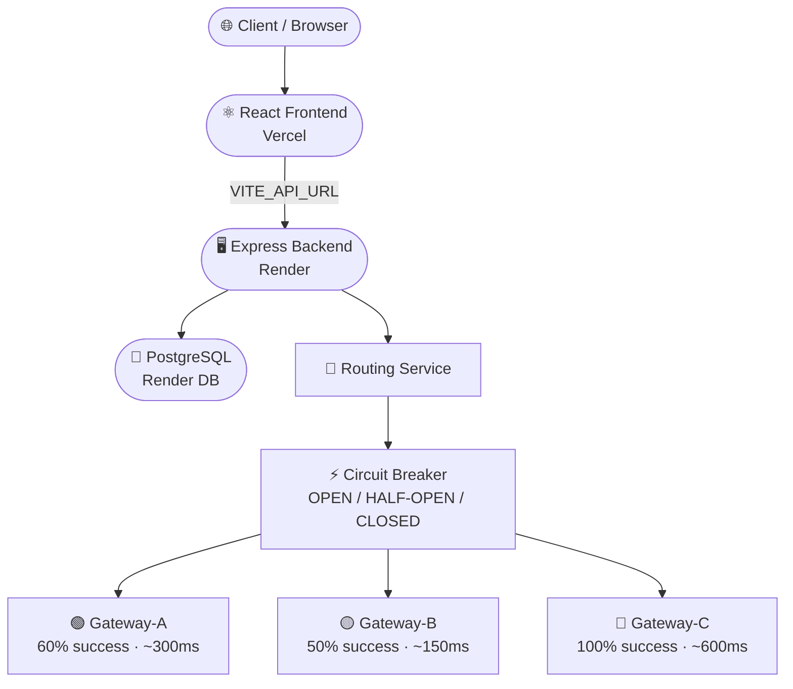

<div align="center">


# Smart Payment Routing Simulator

**Enterprise-grade distributed payment infrastructure — simulated.**

[](https://sprs-mu.vercel.app)
[](https://sprs-backend.onrender.com)
[](https://nodejs.org)
[](https://react.dev)
[](https://www.postgresql.org)
[](#)

</div>

---

## 🌐 What is SPRS?

SPRS is a full-stack distributed systems simulator that replicates how production-grade payment processors — like Stripe, PayPal, or Razorpay — handle extreme traffic, cascading failures, and self-healing recovery. It isn't a toy demo. It runs real concurrent PostgreSQL transactions with atomic SQL operations, a stateful circuit breaker, anomaly detection, and an interactive real-time monitoring dashboard.

> **In short:** Throw 1,000 concurrent payment requests at it. Watch it route, fail, recover, and explain itself — live.

---

## ✨ Feature Highlights

| Feature | Description |
|---|---|
| 🔀 **Intelligent Routing** | Dynamically scores each gateway by health and cascades traffic to fallbacks |
| ⚡ **Circuit Breaker** | Full `CLOSED → OPEN → HALF-OPEN → CLOSED` state machine per gateway |
| 🧠 **Anomaly Detection** | Flags gateways whose live rate drops >20% below statistical baseline |
| 🔒 **Atomic Concurrency** | PostgreSQL `UPDATE ... SET col = col + 1` prevents race conditions under 10k+ RPS |
| 📊 **Real-time Dashboard** | Live charts, animated KPI counters, and colour-coded health badges |
| 🌑 **Dark Fintech UI** | Premium dark DevOps design system with micro-animations |

---

## 🏗️ System Architecture



---

## ⚙️ How It Works

### 🔀 1. Traffic Routing
Every simulated payment hits **Gateway-A** first (highest priority). On failure, the request silently cascades to **Gateway-B**, then to **Gateway-C** — the 100%-reliable safety net. Users never see a failure.

### ⚡ 2. Circuit Breaker State Machine

```
CLOSED ──(5 consecutive failures)──▶ OPEN ──(60s timeout)──▶ HALF-OPEN
  ▲                                                               │
  └─────────────(probe succeeds)─────────────────────────────────┘
              (probe fails → back to OPEN)
```

| State | Behaviour |
|---|---|
| 🔒 **CLOSED** | Normal operation. All requests flow through. |
| 🔓 **OPEN** | Gateway is offline. All traffic bypasses to next fallback. |
| 🔄 **HALF-OPEN** | One probe request allowed through. Others rerouted safely. |

### 🧠 3. Intelligence Layer

- **Health Score:** `(0.6 × SuccessRate) + (0.4 × (1 / AvgLatency))` — computed over the last 20 requests
- **Anomaly Detection:** If live success rate drops >20% below baseline → gateway flagged **Degraded**
- **Atomic SQL:** Counters use `SET col = col + 1` instead of read-modify-write to be fully concurrent-safe

---

## 🗂️ Project Structure

```
sprs/
├── 📁 backend/
│   ├── 📁 src/
│   │   ├── 📁 config/          # DB pool, env vars
│   │   ├── 📁 controllers/     # Route handlers
│   │   ├── 📁 gateways/        # Gateway-A/B/C simulation classes
│   │   ├── 📁 repositories/    # SQL query layer (Repository Pattern)
│   │   ├── 📁 routes/          # Express API routes
│   │   ├── 📁 services/        # Routing & circuit breaker logic
│   │   └── 📄 server.js        # App entry — auto-inits DB on startup
│   ├── 📁 scripts/
│   │   └── 📄 init_db.js       # Schema creation + gateway seeding
│   ├── 📄 .env.example
│   └── 📄 package.json
│
├── 📁 frontend/
│   ├── 📁 src/
│   │   ├── 📁 api/             # Axios client + API modules
│   │   ├── 📁 components/      # Dashboard, Charts, Layout
│   │   └── 📁 pages/           # Dashboard page
│   ├── 📄 .env.example
│   └── 📄 package.json
│
└── 📄 README.md
```

---

## 🚀 Local Development

### Prerequisites
- **Node.js** v18+
- **PostgreSQL** v15+ (or Docker)

### Backend Setup

```bash
cd backend

# Install dependencies
npm install

# Configure environment
cp .env.example .env
# Edit .env — set DATABASE_URL to your local PostgreSQL connection string

# Start the API server (port 5000)
# Tables are created automatically on first startup
npm run dev
```

### Frontend Setup

```bash
cd frontend

# Install dependencies
npm install

# Configure environment
cp .env.example .env.local
# For local dev, leave VITE_API_URL empty (defaults to http://localhost:5000/api/v1)

# Start the Vite dev server (port 5173)
npm run dev
```

Open **http://localhost:5173** and the dashboard is live. ✅

---

## ☁️ Deployment

### Backend → [Render](https://render.com)

1. Create a **Postgres** database on Render — copy the **Internal Database URL**
2. Create a **Web Service** → connect your GitHub repo → set **Root Directory** to `backend`
   - **Build Command:** `npm install`
   - **Start Command:** `npm start`
3. Add environment variables:
   ```
   DATABASE_URL   = <Internal Database URL from step 1>
   PORT           = 5000
   NODE_ENV       = production
   FRONTEND_URL   = https://your-vercel-url.vercel.app
   ```
4. Deploy — tables are auto-created on first boot 🎉

### Frontend → [Vercel](https://vercel.com)

1. Import your GitHub repo → set **Root Directory** to `frontend`
2. Add one environment variable:
   ```
   VITE_API_URL = https://your-render-url.onrender.com/api/v1
   ```
3. Deploy — Vercel auto-runs `npm run build` ✅

---

## 🎮 Chaos Engineering Scenarios

### 💥 Scenario 1 — "The Avalanche"
> Stress-test the full cascade chain

1. Click **Reset Data**
2. Set volume to **1,000 transactions** and hit **Run Simulation**
3. Watch: Gateways A and B trip to ⚠️ **OPEN**, Gateway-C absorbs the overflow at 100% reliability
4. Notice total *attempts* exceed 1,000 — the cascade is doing its job

### 🔄 Scenario 2 — "The Rollercoaster Recovery"
> Observe the HALF-OPEN probe mechanism live

1. Click **Reset Data**
2. Run **100 transactions** — A and B trip to **OPEN**
3. Wait **60 seconds**
4. Run **10 transactions**
5. Watch: exactly **1 probe** hits A, exactly **1 probe** hits B. The other 8 are safely rerouted. If the probe succeeds, consecutive failures drop to **0** and the circuit resets to **CLOSED** ✅

---

## 🛠️ Tech Stack

<div align="center">

| Layer | Technology |
|---|---|
| **Frontend** | React 18 · Vite · Tailwind CSS · Recharts · Lucide-React · Axios |
| **Backend** | Node.js · Express v4 · PostgreSQL · `pg` driver · UUID v8 |
| **Architecture** | Repository Pattern · Stateful Services · Circuit Breaker Pattern |
| **Deployment** | Vercel (frontend) · Render (backend + DB) |

</div>

---

## 📡 API Reference

| Method | Endpoint | Description |
|---|---|---|
| `POST` | `/api/v1/simulate-bulk` | Run N concurrent payment simulations |
| `GET` | `/api/v1/metrics` | Overall success rate + traffic distribution |
| `GET` | `/api/v1/gateway` | Per-gateway health stats + circuit state |
| `DELETE` | `/api/v1/reset` | Reset all transactions and gateway stats |

---

<div align="center">

**Built for high-concurrency, resiliency validation, and chaos engineering.**

*If you found this useful, consider giving it a ⭐*

</div>
